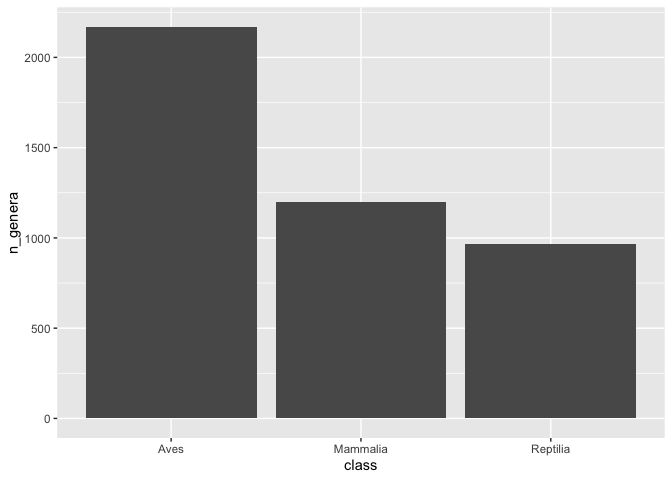
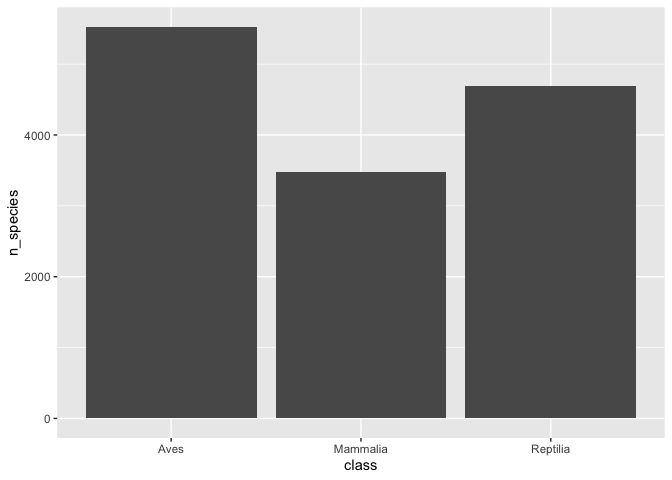
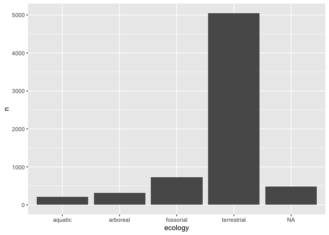
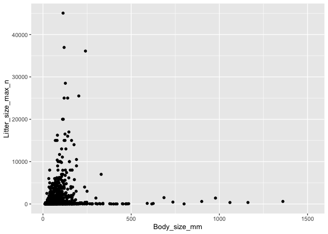
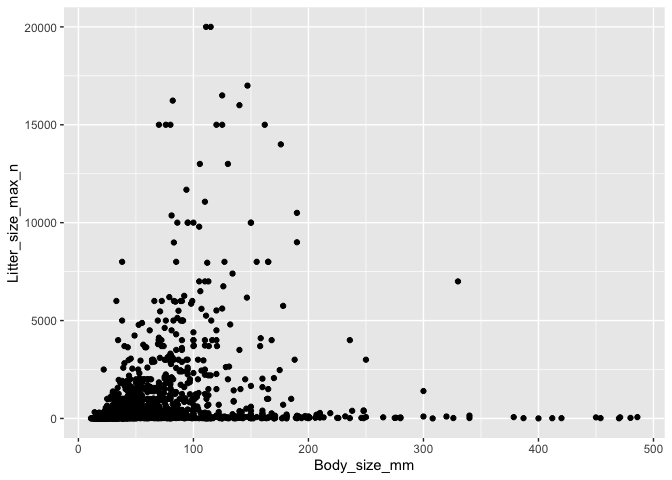

## Instructions
Answer the following questions and complete the exercises in RMarkdown. Please embed all of your code and push your final work to your repository. Your final lab report should be organized, clean, and run free from errors. Remember, you must remove the `#` for the included code chunks to run.  

## Libraries

```r
library(tidyverse)
```

```
## ── Attaching packages ──────────────────────────────────────────────────────────────────────────────────────────── tidyverse 1.3.0 ──
```

```
## ✓ ggplot2 3.2.1     ✓ purrr   0.3.3
## ✓ tibble  2.1.3     ✓ dplyr   0.8.4
## ✓ tidyr   1.0.2     ✓ stringr 1.4.0
## ✓ readr   1.3.1     ✓ forcats 0.4.0
```

```
## ── Conflicts ─────────────────────────────────────────────────────────────────────────────────────────────── tidyverse_conflicts() ──
## x dplyr::filter() masks stats::filter()
## x dplyr::lag()    masks stats::lag()
```

```r
library(naniar)
library(skimr)
```

```
## 
## Attaching package: 'skimr'
```

```
## The following object is masked from 'package:naniar':
## 
##     n_complete
```

## Data
For this homework, we will use two different data sets. Please load `amniota` and `amphibio`.  

### `amniota` data
Myhrvold N, Baldridge E, Chan B, Sivam D, Freeman DL, Ernest SKM (2015). “An amniote life-history
database to perform comparative analyses with birds, mammals, and reptiles.” _Ecology_, *96*, 3109.
doi: 10.1890/15-0846.1 (URL: https://doi.org/10.1890/15-0846.1).

```r
amniota <- 
  readr::read_csv("data/amniota.csv")
```

```
## Parsed with column specification:
## cols(
##   .default = col_double(),
##   class = col_character(),
##   order = col_character(),
##   family = col_character(),
##   genus = col_character(),
##   species = col_character(),
##   common_name = col_character()
## )
```

```
## See spec(...) for full column specifications.
```

### `amphibio` data
Oliveira BF, São-Pedro VA, Santos-Barrera G, Penone C, Costa GC (2017). “AmphiBIO, a global database
for amphibian ecological traits.” _Scientific Data_, *4*, 170123. doi: 10.1038/sdata.2017.123 (URL:
https://doi.org/10.1038/sdata.2017.123).

```r
amphibio <- 
  readr::read_csv("data/amphibio.csv")
```

```
## Parsed with column specification:
## cols(
##   .default = col_double(),
##   id = col_character(),
##   Order = col_character(),
##   Family = col_character(),
##   Genus = col_character(),
##   Species = col_character(),
##   Seeds = col_logical(),
##   OBS = col_logical()
## )
```

```
## See spec(...) for full column specifications.
```

```
## Warning: 125 parsing failures.
##  row col           expected                                                           actual                file
## 1410 OBS 1/0/T/F/TRUE/FALSE Identified as P. appendiculata in Boquimpani-Freitas et al. 2002 'data/amphibio.csv'
## 1416 OBS 1/0/T/F/TRUE/FALSE Identified as T. miliaris in Giaretta and Facure 2004            'data/amphibio.csv'
## 1447 OBS 1/0/T/F/TRUE/FALSE Considered endangered by Soto-Azat et al. 2013                   'data/amphibio.csv'
## 1448 OBS 1/0/T/F/TRUE/FALSE Considered extinct by Soto-Azat et al. 2013                      'data/amphibio.csv'
## 1471 OBS 1/0/T/F/TRUE/FALSE nomem dubitum                                                    'data/amphibio.csv'
## .... ... .................. ................................................................ ...................
## See problems(...) for more details.
```

## Questions  
**1. First, do some exploratory analysis of both data sets. What is the structure, column names, and dimensions?**  

```r
?amniota
```

```
## No documentation for 'amniota' in specified packages and libraries:
## you could try '??amniota'
```

```r
glimpse(amniota)
```

```
## Observations: 21,322
## Variables: 36
## $ class                                 <chr> "Aves", "Aves", "Aves", "Aves",…
## $ order                                 <chr> "Accipitriformes", "Accipitrifo…
## $ family                                <chr> "Accipitridae", "Accipitridae",…
## $ genus                                 <chr> "Accipiter", "Accipiter", "Acci…
## $ species                               <chr> "albogularis", "badius", "bicol…
## $ subspecies                            <dbl> -999, -999, -999, -999, -999, -…
## $ common_name                           <chr> "Pied Goshawk", "Shikra", "Bico…
## $ female_maturity_d                     <dbl> -999.000, 363.468, -999.000, -9…
## $ litter_or_clutch_size_n               <dbl> -999.000, 3.250, 2.700, -999.00…
## $ litters_or_clutches_per_y             <dbl> -999, 1, -999, -999, 1, -999, -…
## $ adult_body_mass_g                     <dbl> 251.500, 140.000, 345.000, 142.…
## $ maximum_longevity_y                   <dbl> -999.00000, -999.00000, -999.00…
## $ gestation_d                           <dbl> -999, -999, -999, -999, -999, -…
## $ weaning_d                             <dbl> -999, -999, -999, -999, -999, -…
## $ birth_or_hatching_weight_g            <dbl> -999, -999, -999, -999, -999, -…
## $ weaning_weight_g                      <dbl> -999, -999, -999, -999, -999, -…
## $ egg_mass_g                            <dbl> -999.00, 21.00, 32.00, -999.00,…
## $ incubation_d                          <dbl> -999.00, 30.00, -999.00, -999.0…
## $ fledging_age_d                        <dbl> -999.00, 32.00, -999.00, -999.0…
## $ longevity_y                           <dbl> -999.00000, -999.00000, -999.00…
## $ male_maturity_d                       <dbl> -999, -999, -999, -999, -999, -…
## $ inter_litter_or_interbirth_interval_y <dbl> -999, -999, -999, -999, -999, -…
## $ female_body_mass_g                    <dbl> 352.500, 168.500, 390.000, -999…
## $ male_body_mass_g                      <dbl> 223.000, 125.000, 212.000, 142.…
## $ no_sex_body_mass_g                    <dbl> -999.0, 123.0, -999.0, -999.0, …
## $ egg_width_mm                          <dbl> -999, -999, -999, -999, -999, -…
## $ egg_length_mm                         <dbl> -999, -999, -999, -999, -999, -…
## $ fledging_mass_g                       <dbl> -999, -999, -999, -999, -999, -…
## $ adult_svl_cm                          <dbl> -999.00, 30.00, 39.50, -999.00,…
## $ male_svl_cm                           <dbl> -999, -999, -999, -999, -999, -…
## $ female_svl_cm                         <dbl> -999, -999, -999, -999, -999, -…
## $ birth_or_hatching_svl_cm              <dbl> -999, -999, -999, -999, -999, -…
## $ female_svl_at_maturity_cm             <dbl> -999, -999, -999, -999, -999, -…
## $ female_body_mass_at_maturity_g        <dbl> -999, -999, -999, -999, -999, -…
## $ no_sex_svl_cm                         <dbl> -999, -999, -999, -999, -999, -…
## $ no_sex_maturity_d                     <dbl> -999, -999, -999, -999, -999, -…
```

_In the `amphibio` data, NA's are represented by "NA"._

```r
?amphibio
```

```
## No documentation for 'amphibio' in specified packages and libraries:
## you could try '??amphibio'
```

```r
glimpse(amphibio)
```

```
## Observations: 6,776
## Variables: 38
## $ id                      <chr> "Anf0001", "Anf0002", "Anf0003", "Anf0004", "…
## $ Order                   <chr> "Anura", "Anura", "Anura", "Anura", "Anura", …
## $ Family                  <chr> "Allophrynidae", "Alytidae", "Alytidae", "Aly…
## $ Genus                   <chr> "Allophryne", "Alytes", "Alytes", "Alytes", "…
## $ Species                 <chr> "Allophryne ruthveni", "Alytes cisternasii", …
## $ Fos                     <dbl> NA, NA, NA, NA, NA, 1, 1, 1, 1, 1, 1, 1, 1, N…
## $ Ter                     <dbl> 1, 1, 1, 1, 1, 1, 1, 1, 1, 1, 1, 1, 1, 1, 1, …
## $ Aqu                     <dbl> 1, 1, 1, 1, NA, 1, 1, 1, 1, 1, 1, 1, 1, 1, 1,…
## $ Arb                     <dbl> 1, 1, 1, 1, 1, 1, NA, NA, NA, NA, NA, NA, NA,…
## $ Leaves                  <dbl> NA, NA, NA, NA, NA, NA, NA, NA, NA, NA, NA, N…
## $ Flowers                 <dbl> NA, NA, NA, NA, NA, NA, NA, NA, NA, NA, NA, N…
## $ Seeds                   <lgl> NA, NA, NA, NA, NA, NA, NA, NA, NA, NA, NA, N…
## $ Fruits                  <dbl> NA, NA, NA, NA, NA, NA, NA, NA, NA, NA, NA, N…
## $ Arthro                  <dbl> 1, 1, 1, NA, 1, 1, 1, 1, 1, NA, 1, 1, NA, NA,…
## $ Vert                    <dbl> NA, NA, NA, NA, NA, NA, 1, NA, NA, NA, 1, 1, …
## $ Diu                     <dbl> 1, NA, NA, NA, NA, NA, 1, 1, 1, NA, 1, 1, NA,…
## $ Noc                     <dbl> 1, 1, 1, NA, 1, 1, 1, 1, 1, NA, 1, 1, 1, NA, …
## $ Crepu                   <dbl> 1, NA, NA, NA, NA, 1, NA, NA, NA, NA, NA, NA,…
## $ Wet_warm                <dbl> NA, NA, NA, NA, 1, 1, NA, NA, NA, NA, 1, NA, …
## $ Wet_cold                <dbl> 1, NA, NA, NA, NA, NA, 1, NA, NA, NA, NA, NA,…
## $ Dry_warm                <dbl> NA, NA, NA, NA, NA, NA, NA, NA, NA, NA, NA, N…
## $ Dry_cold                <dbl> NA, NA, NA, NA, NA, NA, NA, NA, NA, NA, NA, N…
## $ Body_mass_g             <dbl> 31.00, 6.10, NA, NA, 2.31, 13.40, 21.80, NA, …
## $ Age_at_maturity_min_y   <dbl> NA, 2.0, 2.0, NA, 3.0, 2.0, 3.0, NA, NA, NA, …
## $ Age_at_maturity_max_y   <dbl> NA, 2.0, 2.0, NA, 3.0, 3.0, 5.0, NA, NA, NA, …
## $ Body_size_mm            <dbl> 31.0, 50.0, 55.0, NA, 40.0, 55.0, 80.0, 60.0,…
## $ Size_at_maturity_min_mm <dbl> NA, 27, NA, NA, NA, 35, NA, NA, NA, NA, NA, N…
## $ Size_at_maturity_max_mm <dbl> NA, 36.0, NA, NA, NA, 40.5, NA, NA, NA, NA, N…
## $ Longevity_max_y         <dbl> NA, 6, NA, NA, NA, 7, 9, NA, NA, NA, NA, NA, …
## $ Litter_size_min_n       <dbl> 300, 60, 40, NA, 7, 53, 300, 1500, 1000, NA, …
## $ Litter_size_max_n       <dbl> 300, 180, 40, NA, 20, 171, 1500, 1500, 1000, …
## $ Reproductive_output_y   <dbl> 1, 4, 1, 4, 1, 4, 6, 1, 1, 1, 1, 1, 1, 1, NA,…
## $ Offspring_size_min_mm   <dbl> NA, 2.6, NA, NA, 5.4, 2.6, 1.5, NA, 1.5, NA, …
## $ Offspring_size_max_mm   <dbl> NA, 3.5, NA, NA, 7.0, 5.0, 2.0, NA, 1.5, NA, …
## $ Dir                     <dbl> 0, 0, 0, 0, 0, 0, 0, 0, 0, 0, 0, 0, 0, 0, 0, …
## $ Lar                     <dbl> 1, 1, 1, 1, 1, 1, 1, 1, 1, 1, 1, 1, 1, 1, 1, …
## $ Viv                     <dbl> 0, 0, 0, 0, 0, 0, 0, 0, 0, 0, 0, 0, 0, 0, 0, …
## $ OBS                     <lgl> NA, NA, NA, NA, NA, NA, NA, NA, NA, NA, NA, N…
```

**2. How many total NAs are in each data set? Do these values make sense? Are NAs represented by any other values?**   

### `amniota`  
_For such a large data set, it is unlikely that there are no NAs. It appears that NAs are represented by "-999"._

```r
amniota %>% 
  summarize(number_nas = sum(is.na(amniota))) #how many NAs
```

```
## # A tibble: 1 x 1
##   number_nas
##        <int>
## 1          0
```

### `amphibio`  

```r
amphibio %>% 
  summarize(number_nas = sum(is.na(amphibio)))
```

```
## # A tibble: 1 x 1
##   number_nas
##        <int>
## 1     170691
```

**3. Make any necessary replacements in the data such that all NAs appear as "NA".**   

```r
amniota_na <- amniota %>% 
  na_if("-999") #convert all -999 values to NA
```


```r
amniota_na %>% 
  summarize(number_nas = sum(is.na(amniota_na))) #how many NAs
```

```
## # A tibble: 1 x 1
##   number_nas
##        <int>
## 1     528196
```

**4. Use the package `naniar` to produce a summary, including percentages, of missing data in each column for both data sets.**  

```r
naniar::miss_var_summary(amniota_na) #how many NAs with percentages
```

```
## # A tibble: 36 x 3
##    variable                       n_miss pct_miss
##    <chr>                           <int>    <dbl>
##  1 subspecies                      21322    100  
##  2 female_body_mass_at_maturity_g  21318    100. 
##  3 female_svl_at_maturity_cm       21120     99.1
##  4 fledging_mass_g                 21111     99.0
##  5 male_svl_cm                     21040     98.7
##  6 no_sex_maturity_d               20860     97.8
##  7 egg_width_mm                    20727     97.2
##  8 egg_length_mm                   20702     97.1
##  9 weaning_weight_g                20258     95.0
## 10 female_svl_cm                   20242     94.9
## # … with 26 more rows
```


```r
naniar::miss_var_summary(amphibio)
```

```
## # A tibble: 38 x 3
##    variable n_miss pct_miss
##    <chr>     <int>    <dbl>
##  1 OBS        6776    100  
##  2 Fruits     6774    100. 
##  3 Flowers    6772     99.9
##  4 Seeds      6772     99.9
##  5 Leaves     6752     99.6
##  6 Dry_cold   6735     99.4
##  7 Vert       6657     98.2
##  8 Wet_cold   6625     97.8
##  9 Crepu      6608     97.5
## 10 Dry_warm   6572     97.0
## # … with 28 more rows
```

**5. For the `amniota` data, calculate the number of NAs in the `egg_mass_g` column sorted by taxonomic class; i.e. how many NAs are present in the `egg_mass_g` column in birds, mammals, and reptiles? Does this results make sense biologically? How do these results affect your interpretation of NAs?**  

_NAs could reflect missing data (no observations were recorded) or it could reflect data that are truly not applicable._  


```r
amniota_na %>%
  select(class, egg_mass_g) %>% 
  group_by(class) %>%
  naniar::miss_var_summary(order=T)
```

```
## Warning: `cols` is now required.
## Please use `cols = c(data)`
```

```
## # A tibble: 3 x 4
## # Groups:   class [3]
##   class    variable   n_miss pct_miss
##   <chr>    <chr>       <int>    <dbl>
## 1 Aves     egg_mass_g   4914     50.1
## 2 Mammalia egg_mass_g   4953    100  
## 3 Reptilia egg_mass_g   6040     92.0
```

**6. Which taxonomic classes are represented in the data? Summarize this in a chart then make a barplot that shows the proportion of observations in each taxonomic class.**

```r
amniota_na %>% 
  count(class, sort = T)
```

```
## # A tibble: 3 x 2
##   class        n
##   <chr>    <int>
## 1 Aves      9802
## 2 Reptilia  6567
## 3 Mammalia  4953
```


```r
amniota_na %>% 
  ggplot(aes(x=class))+
  geom_bar()
```

<!-- -->

**7. Let's explore the taxonomic composition of the data a bit more. How many genera are represented by taxonomic class? Present this as a data table and bar plot.**

```r
amniota_na %>%
  group_by(class) %>% 
  summarize(n_genera = n_distinct(genus))
```

```
## # A tibble: 3 x 2
##   class    n_genera
##   <chr>       <int>
## 1 Aves         2169
## 2 Mammalia     1200
## 3 Reptilia      967
```


```r
amniota_na %>%
  group_by(class) %>% 
  summarize(n_genera = n_distinct(genus)) %>% 
  ggplot(aes(x=class, y=n_genera))+
  geom_bar(stat="identity")
```

<!-- -->

**8. Lastly, how many species are represented in each taxonomic class? Present this as a data table and bar plot.**

```r
amniota_na %>%
  group_by(class) %>% 
  summarize(n_species = n_distinct(species))
```

```
## # A tibble: 3 x 2
##   class    n_species
##   <chr>        <int>
## 1 Aves          5525
## 2 Mammalia      3473
## 3 Reptilia      4692
```


```r
amniota_na %>%
  group_by(class) %>% 
  summarize(n_species = n_distinct(species)) %>% 
  ggplot(aes(x=class, y=n_species))+
  geom_bar(stat="identity")
```

<!-- -->

**9. The `amphibio` data includes information on ecology. Each species is classified as fossorial, terrestrial, aquatic, or arboreal. How many species are in each of these categories? Make a bar plot to visualize these results. Which category is most/ least represented in the data?**

```r
amphibio_ecology <- 
  amphibio %>% 
  select(Family, Genus, Species, Fos, Ter, Aqu, Arb) %>% 
  mutate(ecology = case_when(Fos == 1 ~ "fossorial",
                             Ter == 1 ~ "terrestrial",
                             Aqu == 1 ~ "aquatic",
                             Arb == 1 ~ "arboreal"))%>% 
  select(-Fos, -Ter, -Aqu, -Arb) %>% 
  group_by(ecology) %>% 
  summarize(n=n())
amphibio_ecology
```

```
## # A tibble: 5 x 2
##   ecology         n
##   <chr>       <int>
## 1 aquatic       213
## 2 arboreal      310
## 3 fossorial     723
## 4 terrestrial  5047
## 5 <NA>          483
```


```r
amphibio_ecology %>% 
  ggplot(aes(x=ecology, y=n))+
  geom_bar(stat="identity")
```

<!-- -->

**10. For the amphibio data, we are interested to know if body size is correlated with litter size? Make a plot that shows this relationship. You should notice that there are outliers. Can you think of a way to identify the outliers for both body size and litter size? What happens when you then re-plot the data?**

```r
amphibio %>% 
  ggplot(aes(x=Body_size_mm, y=Litter_size_max_n))+
  geom_point(na.rm=T)
```

<!-- -->
### Body_size_mm>=500

```r
amphibio %>% 
  select(Family, Genus, Species, Body_size_mm) %>% 
  filter(Body_size_mm>=500)
```

```
## # A tibble: 46 x 4
##    Family           Genus          Species                      Body_size_mm
##    <chr>            <chr>          <chr>                               <dbl>
##  1 Amphiumidae      Amphiuma       Amphiuma means                      1162 
##  2 Amphiumidae      Amphiuma       Amphiuma tridactylum                1060 
##  3 Cryptobranchidae Andrias        Andrias davidianus                   900 
##  4 Cryptobranchidae Andrias        Andrias japonicus                   1360 
##  5 Cryptobranchidae Cryptobranchus Cryptobranchus alleganiensis         737.
##  6 Sirenidae        Siren          Siren intermedia                     686 
##  7 Sirenidae        Siren          Siren lacertina                      978 
##  8 Caeciliidae      Caecilia       Caecilia abitaguae                  1303 
##  9 Caeciliidae      Caecilia       Caecilia antioquiaensis             1200 
## 10 Caeciliidae      Caecilia       Caecilia attenuata                   910 
## # … with 36 more rows
```

### Litter_size_max_n>=20000

```r
amphibio %>% 
  select(Family, Genus, Species, Litter_size_max_n) %>% 
  filter(Litter_size_max_n>=20000)
```

```
## # A tibble: 9 x 4
##   Family    Genus         Species                   Litter_size_max_n
##   <chr>     <chr>         <chr>                                 <dbl>
## 1 Bufonidae Amietophrynus Amietophrynus garmani                 20000
## 2 Bufonidae Amietophrynus Amietophrynus gutturalis              25000
## 3 Bufonidae Amietophrynus Amietophrynus pantherinus             25000
## 4 Bufonidae Anaxyrus      Anaxyrus americanus                   20000
## 5 Bufonidae Anaxyrus      Anaxyrus cognatus                     45054
## 6 Bufonidae Anaxyrus      Anaxyrus woodhousii                   28500
## 7 Bufonidae Pseudepidalea Pseudepidalea viridis                 36950
## 8 Bufonidae Rhinella      Rhinella marina                       36100
## 9 Ranidae   Lithobates    Lithobates catesbeianus               25500
```

### rescaled plot

```r
amphibio %>% 
  filter(Body_size_mm<=500 & Litter_size_max_n<=20000)%>% 
  ggplot(aes(x=Body_size_mm, y=Litter_size_max_n))+
  geom_point(na.rm=T)
```

<!-- -->

## Push your final code to GitHub!
Please be sure that you check the `keep md` file in the knit preferences. 
